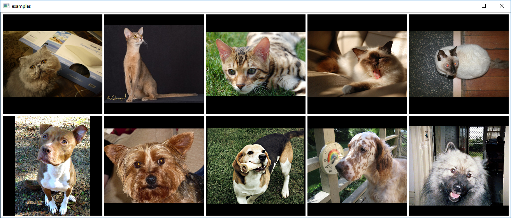

# Introduction

For thousands of years dogs are the best friends of humans and humans are servants to cats. Seeing a four-legged animal, we 
can say in no time which of those two classes we are looking at. Let's teach computers to do the same!

# Set-up

```sh
$ git clone --recurse-submodules https://github.com/dkoguciuk/woof-or-meow
$ cd woof-or-meow
$ pip install -r requirements.txt
```

# Usage

### Data download

We are using [The Oxford-IIIT Pet Dataset](http://www.robots.ox.ac.uk/~vgg/data/pets/), but no worry, download script is provided here. Just type:
```sh
$ python dataset_download.py
```
Now, you can take a look on the data with simple visualization script:
```sh
$ python dataset_visualize.py
```
Sample output:


### Features

There are two seperate feature extraction methods implemented: HOG and CNN. To extract HOG featrues one can use the following:
```sh
$ python dataset_extract_features_hog.py
```
Features will be saved under features/hog directory. Similarly, one can use InceptionV3 CNN to extract features with:
```sh
$ python dataset_extract_features_cnn.py
```
There are olso two dimensionality reduction methods implemented: PCA and t-SNE:
```sh
$ python dataset_decompose.py -f hog
```

### Classification

There are two classifiers implemented: SVM and MLP, which can be specified via -c param:
```sh
$ python dataset_classify.py -f hog -c svm
```

